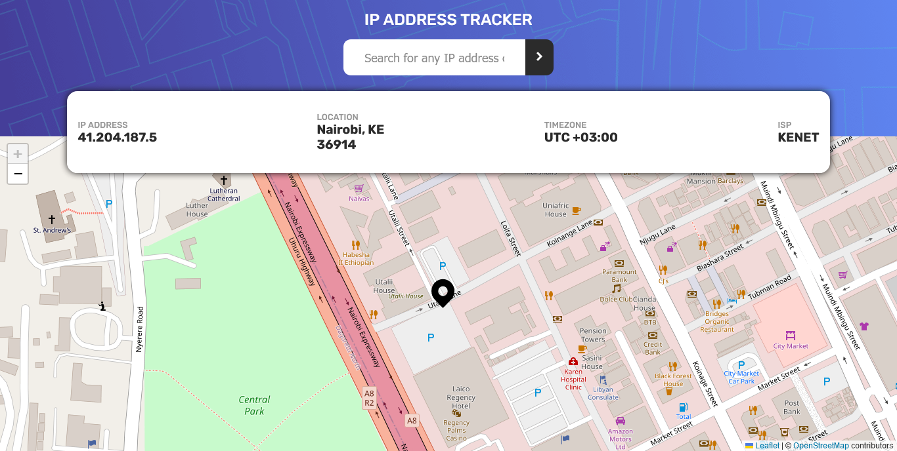
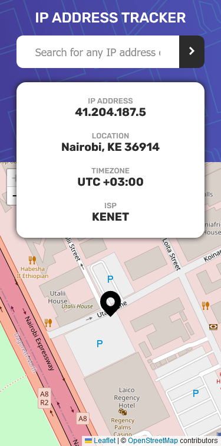
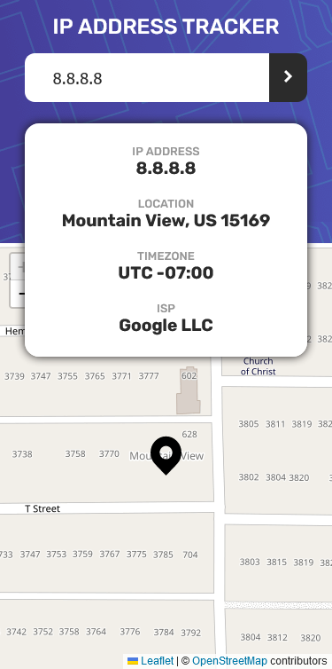
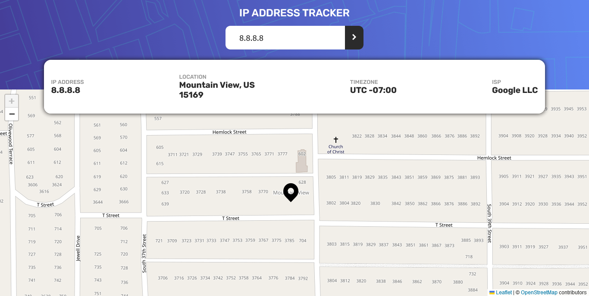

# Frontend Mentor - IP address tracker solution

This is a solution to the [IP address tracker challenge on Frontend Mentor](https://www.frontendmentor.io/challenges/ip-address-tracker-I8-0yYAH0). Frontend Mentor challenges help you improve your coding skills by building realistic projects.

## Table of contents

- [Overview](#overview)
  - [The challenge](#the-challenge)
  - [Screenshot](#screenshot)
  - [Links](#links)
- [My process](#my-process)
  - [Built with](#built-with)
  - [What I learned](#what-i-learned)
  - [Useful resources](#useful-resources)
- [Author](#author)

## Overview

### The challenge

Users should be able to:

- View the optimal layout for each page depending on their device's screen size
- See hover states for all interactive elements on the page
- See their own IP address on the map on the initial page load
- Search for any IP addresses or domains and see the key information and location

### Screenshot

### Links

- Solution URL: [Add solution URL here](https://github.com/Samwelomwenga/ip-address-tracker)
- Live Site URL: [Add live site URL here](https://your-live-site-url.com)

## My process

### Built with

- CSS custom properties
- Flexbox
- CSS Grid
- Mobile-first workflow
- [React](https://reactjs.org/) - JS library
- [React-leaflet](https://react-leaflet.js.org/) - React Map library
- [Axios](https://axios-http.com/) - Data Fetching library
- [Styled Components](https://styled-components.com/) - For styles

### What I learned

I learnt how to use react-leaflet and styled-components. I also learnt how to use axios to fetch data from an API.
I learnt how to render a map using react-leaflet and how to use styled-components to style my components.

### Useful resources

- [react-leaflet-docs](https://react-leaflet.js.org/) - This helped me for understanding how to use react-leaflet. I'd recommend it to anyone still learning this concept. Also, their documentation is really simple and easy to understand.
- [styled-component-docs](https://www.styled-components.com/) - This is an amazing article which helped me finally understand styled-components. I'd recommend it to anyone still learning this concept. 

## Author

- Frontend Mentor - [@Samwelomwenga](https://www.frontendmentor.io/profile/Samwelomwenga)
